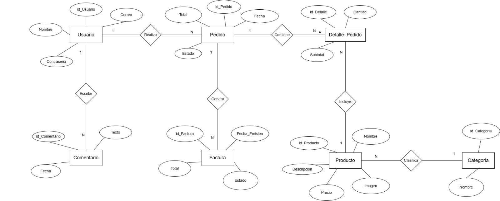

# Sistema_Ventas
Holaaaaaa
## Descripción del Negocio
Botaniq Bake es una repostería artesanal ubicada en Uruguay
que se especializa en la elaboración y venta de postres de
alta calidad. El negocio opera bajo las siguientes reglas:

---

## Reglas del Negocio

- Los productos son elaborados de forma artesanal con 
  ingredientes selectos.
- El catálogo está organizado por categorías: Tortas, Tartas,
  Pies, Cupcakes, Cookies, Alfajores, Salado, Petit Fours
  y Hora del Té.
- Los clientes pueden explorar el catálogo en línea y realizar
  pedidos personalizados según la ocasión.
- Se ofrecen tortas personalizadas para eventos como 
  cumpleaños y celebraciones especiales.
- Los clientes registrados pueden dejar comentarios sobre
  los productos y el servicio.
- Los precios están establecidos en Pesos Uruguayos según
  el tipo y tamaño del producto.
- El negocio gestiona sus ventas a través de un sistema web
  que permite administrar productos, pedidos y clientes.

---

## Entidades y Atributos

### Usuario
- id_usuario
- nombre
- correo
- contraseña
- rol (cliente / admin)

### Producto
- id_producto
- nombre
- descripcion
- precio
- imagen
- id_categoria

### Categoria
- id_categoria
- nombre (Tortas, Cookies, Pies, Tartas, etc.)

### Pedido
- id_pedido
- fecha
- total
- estado (pendiente / entregado)
- id_usuario

### Detalle_Pedido
- id_detalle
- cantidad
- subtotal
- id_pedido
- id_producto

### Comentario
- id_comentario
- texto
- fecha
- id_usuario

---

## Relaciones

- Un **Usuario** puede tener muchos **Pedidos**
- Un **Pedido** puede tener muchos **Productos** (a través de Detalle_Pedido)
- Un **Producto** pertenece a una **Categoría**
- Un **Usuario** puede dejar muchos **Comentarios**

---

## Login del Panel Administrador
Pantalla de acceso exclusivo para administradores del sistema.

---

## Enunciado del Sistema de Ventas 
Se desea diseñar una base de datos para gestionar un sistema de ventas en línea de productos de repostería, como tortas, cookies, pies y tartas. El sistema permitirá administrar usuarios, productos, pedidos, comentarios y facturación. En el sistema existen diferentes tipos de usuarios, los cuales pueden tener el rol de cliente o administrador. De cada usuario se almacena su identificador único, nombre, correo electrónico, contraseña y rol. Los usuarios pueden realizar múltiples pedidos y también pueden escribir comentarios sobre los productos o el servicio. Los productos disponibles en la tienda cuentan con información como identificador, nombre, descripción, precio e imagen. Cada producto pertenece a una categoría, como tortas, cookies, pies o tartas, y cada categoría puede agrupar varios productos. Los pedidos realizados por los usuarios incluyen datos como identificador, fecha, total y estado (pendiente o entregado). Cada pedido pertenece a un único usuario, pero un usuario puede realizar varios pedidos a lo largo del tiempo. Cada pedido está compuesto por uno o varios detalles de pedido, donde se especifica la cantidad de productos adquiridos y el subtotal correspondiente. Cada detalle de pedido está asociado a un producto específico, y un mismo producto puede aparecer en múltiples detalles de pedido. Además, el sistema permite registrar comentarios realizados por los usuarios, almacenando un identificador, el texto del comentario, la fecha y el usuario que lo realizó. Finalmente, por cada pedido generado, se emite una factura. Cada factura contiene un identificador, número de factura, fecha de emisión, total, estado (emitida, enviada o pagada) y un archivo en formato PDF. Cada pedido genera exactamente una factura, estableciendo una relación uno a uno entre pedido y factura.

---

## Diagrama Entidad Relacion (ER)

